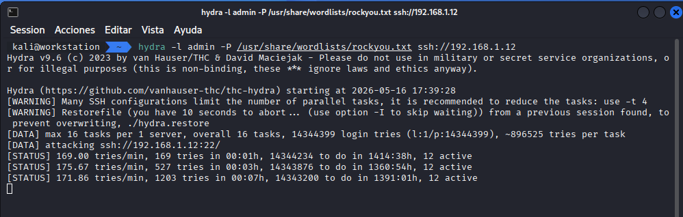
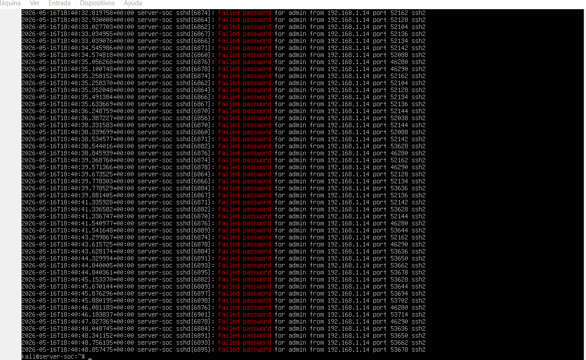
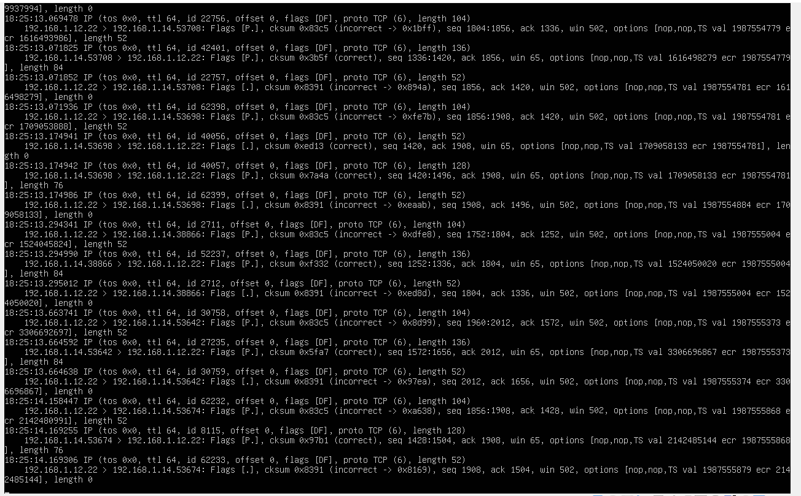
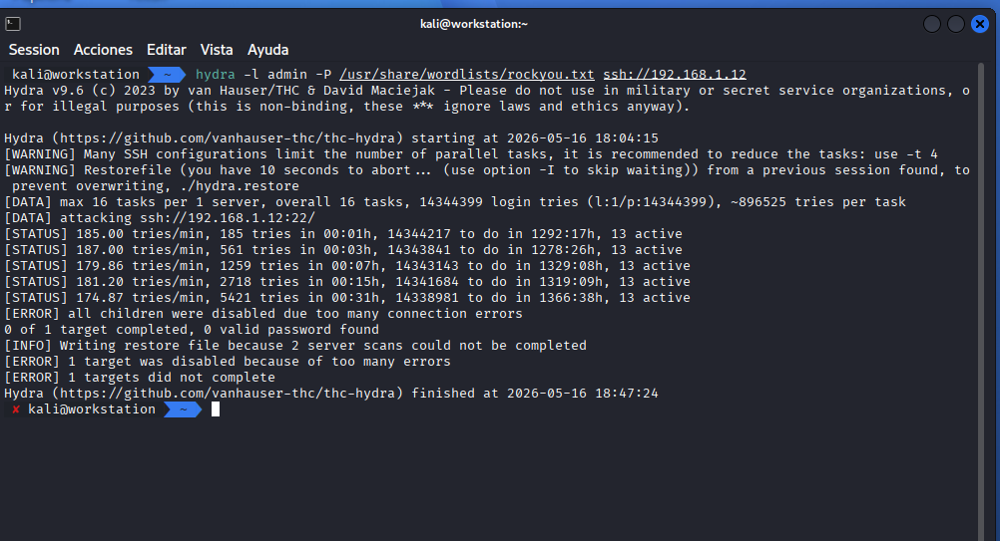

# SOC-Lab-SSH-BruteForce
# 🔐 SSH Brute Force Attack (Hydra)

---

## 🔴 Ejecución del ataque

Se observa la herramienta Hydra ejecutando múltiples intentos de autenticación contra el servicio SSH.

---

## 📋 Evidencia en logs

El sistema registra múltiples intentos fallidos de autenticación desde la IP atacante.

---

## 🌐 Análisis de red

Se identifican múltiples paquetes SYN dirigidos al puerto 22, indicando intentos repetidos de conexión.

---

## 🛑 Mitigación

Se aplica una regla en iptables para bloquear la IP atacante.

---

## ✅ Resultado

Tras aplicar la regla, el ataque deja de ser efectivo y no se establecen nuevas conexiones.
